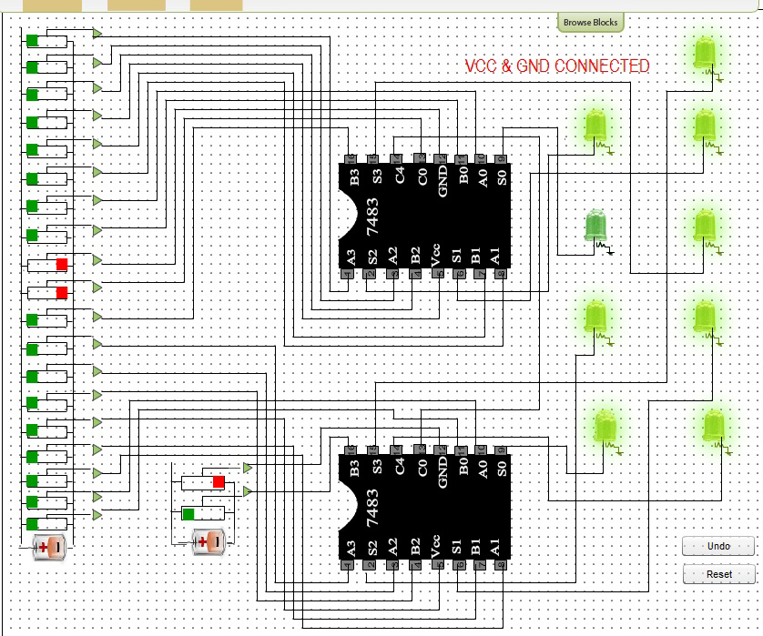

### Procedure
 
                            
                            

Please follow these steps to do the experiment.

                             
                             
                            
 
Please follow these steps to do the experiment(Part-I)

 

 <ul style="list-style:none">
 
  <li class="expt1"> 1.&nbsp; At first click on the Vcc switch that means Vcc = 1 and GND = 0 , show message Vcc & GND properly connected.  
   
</ul>    
     
    </li>                      
  
                                 
                               
                              
<ul style="list-style:none">
 
<li class="expt1"> 2.&nbsp;  Next, A0= 1, A1= 0, A2= 0, A3= 0 and B0= 1, B1= 0, B2= 0, B3= 0 now you can see the output result of  S0= 0, S1= 1, S2= 0, S3= 0 and C4= 0.  
    
 </ul>    
     
    </li>                      
  
  
                               
                                 
                                 
                               
                                                       
 <ul style="list-style:none">
 
 <li class="expt1"> 3.&nbsp;  Next,  A0= 0, A1= 0, A2= 0, A3= 0 and B0= 1, B1= 1, B2= 0, B3= 0 now you can see the output result of  S0= 1, S1= 1, S2= 0, S3= 0 and C4= 0.  
    
</ul>    
     
    </li>                      
   
   
                                
                                 
                                 
                             
<ul style="list-style:none">
 
 <li class="expt1"> 4.&nbsp;  Next, A0= 0, A1= 0, A2= 0, A3= 1 and B0= 0, B1= 0, B2= 0, B3= 1 now you can see the output result of  S0= 0, S1= 0, S2= 0, S3= 0 and C4= 1.  
    
</ul>    
     
    </li>                      
   
  
                               
                                 
                                 
                               
 <ul style="list-style:none">
    <li class="expt1"> 5.&nbsp;  Next, A0= 1, A1= 1, A2= 1, A3= 1 and B0= 1, B1= 1, B2= 1, B3= 1 now you can see the output result of  S0= 0, S1= 1, S2= 1, S3= 1 and C4= 1.  
    
</ul>    
     
    </li>                      
   
   
                             
                               
 
                                 
                                 
Please follow these steps to do the experiment(Part-II)

 

 <ul style="list-style:none">
 
<li class="expt1"> 1.&nbsp; At first click on the Browse Block button  
    2.&nbsp; Next, drag the Adder block and drop it onto the bread board.
    </ul>    
     
    </li>                      
   
                                 
                                
                                 
                                 
                                
                                 
                                 
         <ul style="list-style:none">
 
<li class="expt1"> 3.&nbsp;  Next, drag the Bus block and drop it onto the bread board.  
    
</ul>    
     
    </li>                      
  
 
                                
                                 
                                 
                                
                                 
                                  
                                                       
  <ul style="list-style:none">
 
 <li class="expt1"> 4.&nbsp;  Next, drag the output block and drop it onto the bread board.  
    
</ul>    
     
    </li>                      
   
  
                                
                                 
                                 
                                
                                  
                                 
                                 <ul style="list-style:none">
 
 <li class="expt1"> 5.&nbsp;  Next, make a connection from switch A to A3 of the 1st Adder..  
    
 </ul>    
     
    </li>                      
   
  
                                
                                 
                                 
                                
                                  
                                 
                                 <ul style="list-style:none">
    <li class="expt1"> 6.&nbsp;  Next, make a connection from C4 of the 1st Adder to C0 input of the 2nd Adder..  
    
 </ul>    
     
    </li>                      
   
 
                                
                                 
                                 
                                
   
                                 
                              
<ul style="list-style:none">
    <li class="expt1"> 7.&nbsp;  Next, make a connection from switch L to A3 of the 2nd Adder...  
    
</ul>    
     
    </li>                      
   
   
                                
                                 
                                    
                               
<ul style="list-style:none">
    <li class="expt1"> 8.&nbsp; Next, make a connection from S0 of 1st Adder to 3rd LED...     
    
</ul>    
     
    </li>                      
   
   
                                
                                 
                                  
                                
                                  
                                  
                                
                                 <ul style="list-style:none">
    <li class="expt1"> 9.&nbsp;  Overall connection...  
    
</ul>    
     
    </li>                      
   
  
                                
                                 
                                  
                                 <ul style="list-style:none">
    <li class="expt1"> 10.&nbsp;  Switch on the Vcc of the 1st & 2nd Adder & switch on the A0 & B0 of 1st Adder..  
    
</ul>    
     
    </li>                      
   
  
                               
                                 
                                  
                                   <ul style="list-style:none">
    <li class="expt1"> 11.&nbsp;  Switch on the Vcc of the 1st & 2nd Adder & switch on the A0,A1,A2,A3 & B0,B1,B2,B3 of 1st Adder and switch on the A0,A1,A2,A3 & B0,B1,B2,B3 of 2nd Adder ..  
    
 </ul>    
     
    </li>                      
   
  
                                
                                 
                                 
                                <ul style="list-style:none">
    <li class="expt1"> 12.&nbsp;  Switch on the Vcc of the 1st & 2nd Adder & switch on the A0,A1,A2,A3 & B0,B1,B2,B3 of 2nd Adder ..  
    
 </ul>    
     
    </li>                      
   
  
                                
                                 
                                  
                                <ul style="list-style:none">
    <li class="expt1"> 13.&nbsp;  Switch on the Vcc of the 1st & 2nd Adder & switch on the A0,A1,A2,A3 & B0,B1,B2,B3 of 1st Adder ..  
    
</ul>    
     
    </li>                      
   
  
                                
                                 
                                  
                            
Please follow these steps to do the experiment(Part-III)

                           

 <ul style="list-style:none">
 
 <li class="expt1"> 1.&nbsp; At first click on the Browse Block button  
    2.&nbsp; Next, drag the Adder block and drop it onto the bread board. 
    3.&nbsp; Next, drag the Ex-OR-Gate block and drop it onto the bread board.
    </ul>    
     
    </li>                                 
    
                                 
                                
                                 
                                 
                                
                                  
                                   
                                <ul style="list-style:none">
  <li class="expt1"> 4.&nbsp;  Next, drag the Bus block and drop it onto the bread board.  
    
 </ul>    
     
    </li>  
     
      
        
     <ul style="list-style:none">
 
<li class="expt1"> 5.&nbsp;  Next, drag the output block and drop it onto the bread board.  
                       6.&nbsp;  Next, make a connection from switch A to A3 of the  Adder.. 
    
    
 </ul>    
     
    </li>                      
   
  
                                
                                 
                                   
                                 
                                 
                                   
                                 
                                 
                                  
     <li class="expt1"> 7.&nbsp;  Next, make a connection from switch H to 1st pin of 7486.  
      </ul>    
     
    </li>                      
   
  
                                
                                 
                                   
                                 
                                 
                                 
    <li class="expt1"> 8.&nbsp;  Next, make a connection from C0 of Adder to 2nd pin of 7486.
    
    
</ul>    
     
    </li> 
       
                                
                                 
                                   
                                 
                                 
                                  
                                 <li class="expt1"> 9.&nbsp;  Next, make a connection from 2nd pin of 7486 to 5th pin of 7486. 
                                                   10.&nbsp;  Next, make a connection from 5th pin of 7486 to 9th pin of 7486. 
                                                   11.&nbsp;  Next, make a connection from 9th pin of 7486 to 12th pin of 7486. 
    </ul>    
     
    </li> 
       
                                
                                 
                                   
                                 
                                 
                                    
                                
                                 
                                  
                                 <li class="expt1"> 12.&nbsp;  Next, make a connection from 11th pin of 7486 to B3 of Adder. 
                                                   13.&nbsp;  Next, make a connection from 8th pin of 7486 to B2 of Adder. 
                                                 
 </ul>    
     
    </li> 
       
                                
                                 
                                   
                                 
                                 
                                  
                                 <li class="expt1"> 13.&nbsp;  Next, make a connection from 3rd pin of 7486 to B0 of Adder. 
                                                   14.&nbsp;  Next, make a connection from 6th pin of 7486 to B1 of Adder. 
                                                 
 </ul>    
     
    </li> 
       
                                
                                 
                                   
                                 
                                 
                                  
                                 <li class="expt1"> 15.&nbsp; Next, make a connection from S1 of Adder to 2nd LED...     
    
 </ul>    
     
    </li>                      
   
  
                                
                                 
                                   
                                 
   
                                 
                                 
                                  
     <li class="expt1"> 16.&nbsp; Next, switch on the Vcc of Adder & 14th pin of 7486(for Vcc) and switch on the ADD/SUB then switch on the A0,A1,A2 of Adder & switch on the B0,B2 of 7486.    
    
 </ul>    
     
    </li>                      
   
   
                                
                                 
                                  
     <li class="expt1"> 17.&nbsp; Next, switch on the Vcc of Adder & 14th pin of 7486(for Vcc) and switch on the ADD/SUB then switch on the A0,A2 of Adder & switch on the B0,B1,B2 of 7486.    
    
 </ul>    
     
    </li>                      
   
  
                                
                                 
                                  
     <li class="expt1"> 18.&nbsp; Next, switch on the Vcc of Adder & 14th pin of 7486(for Vcc) and switch off the ADD/SUB then switch on the A0,A1,A2,A3 of Adder & switch on the B0,B1,B2,B3 of 7486.    
    
</ul>    
     
    </li>                      
   
  
                                
                                 
                                     
         <li class="expt1"> 19.&nbsp; Next, switch on the Vcc of Adder & 14th pin of 7486(for Vcc) and switch off the ADD/SUB then switch off the A0,A1,A2,A3 of Adder & switch on the B0 of 7486.    
    
</ul>    
     
    </li>                      
   
 
                                
                                 
                                 
                          
 
  