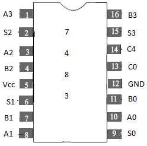
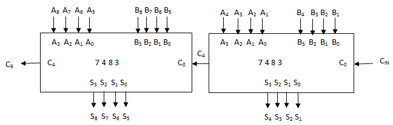
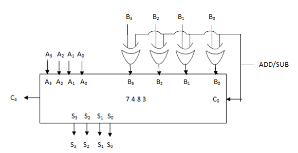

### Link your theory in here

 
                            
                            
 Part I 

                      IC 7483 is 4-bit binary full adder which accepts two 4-bit binary words A3A2A1A0 and B3B2B1B0 and a carry input (C0) as inputs and produces a 4-bit binary sum output S3S2S1S0 and a carry output C4.
                             
                            

                             
                             
                            Figure 1
                             
                             
                             

     The students of virtual DEC Laboratory can verify the functionality of the 7483 chip.Although in principle,there can be 29=512 input paterns possible,the students can verify all zero,all one and some other patterns. 

 
 

                                                     
 Part II 

                                                       

 Cascading of two 7483 chips to achieve addition of two 8-bit numbers A =  A8A7A6A5A4A3A2A1 and B =  B8B7B6B5B4B3B2B1 to produce Sum = S8S7S6S5S4S3S2S1 and carry output C9 of the 217 input patterns possible , the students can test the 8bit adder for all zeros , all ones and some other input patterns.   
                            

                            
                              
                            Figure 2
                            

                             
 Part III 
 
                             

 To implement a 4 bit adder/subtractor using 2's complement number system.Students learnt the use of 7486 (qued 2-input Ex-OR gates)in experiment 3.Using a 7483(parallel adder) and a 7486 chip one can realize 4 bit adder/subtractor.If ADD/SUB = "0" normal addition S = A + B performed.On the other hand if ADD/SUB = "1" then S = A + [B] + 1 where [B] = 1's complement of B.
 For example,if A = 0111(7) and B = 0101(5) then [B] = 1010 and S = 0010 or 2 neglecting carry out C4.If however A = 0101(5) and B = 0111(7) then B = 1000; or S = 1110 which represents -2 in 2's complement number system.
  
  

                            
                              
                            Figure 3                         
                        
