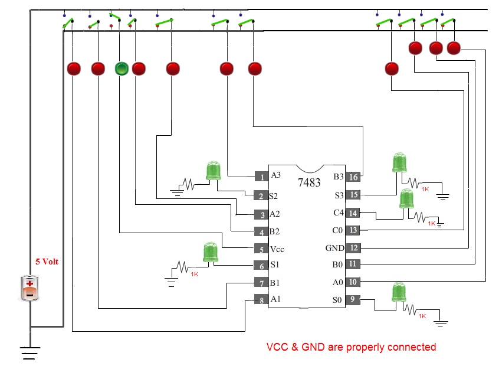
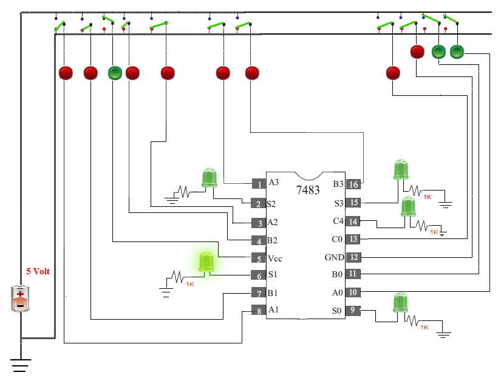
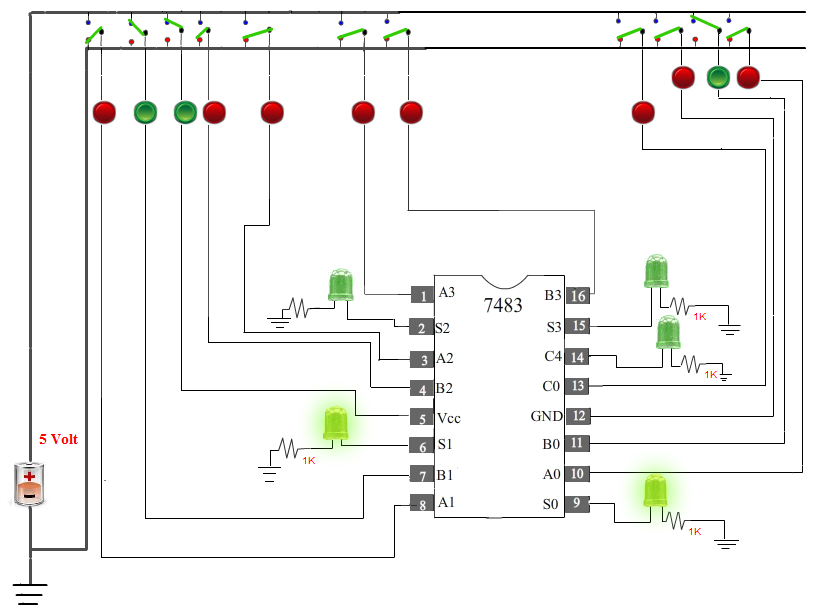
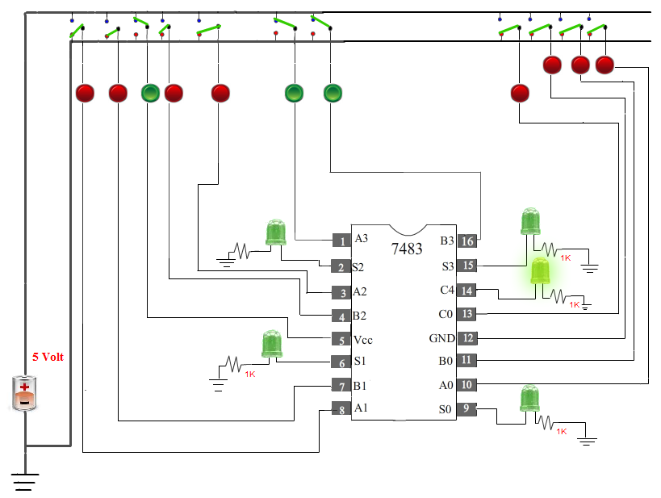

## Procedure
 
#### Please follow these steps to do the experiment

1. At first click on the Vcc switch that means Vcc = 1 and GND = 0 , show message Vcc & GND properly connected. 
            

                              
2. Next, A0= 1, A1= 0, A2= 0, A3= 0 and B0= 1, B1= 0, B2= 0, B3= 0 now you can see the output result of  S0= 0, S1= 1, S2= 0, S3= 0 and C4= 0. 

                               
3.  Next,  A0= 0, A1= 0, A2= 0, A3= 0 and B0= 1, B1= 1, B2= 0, B3= 0 now you can see the output result of  S0= 1, S1= 1, S2= 0, S3= 0 and C4= 0. 

                               
4.&nbsp;  Next, A0= 0, A1= 0, A2= 0, A3= 1 and B0= 0, B1= 0, B2= 0, B3= 1 now you can see the output result of  S0= 0, S1= 0, S2= 0, S3= 0 and C4= 1. 

                               
5. Next, A0= 1, A1= 1, A2= 1, A3= 1 and B0= 1, B1= 1, B2= 1, B3= 1 now you can see the output result of  S0= 0, S1= 1, S2= 1, S3= 1 and C4= 1.

                               

                                